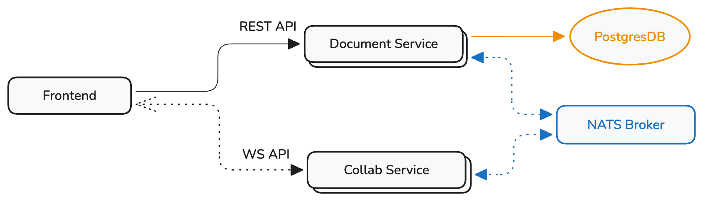

# Doclet


Anonymous real-time collaboration on rich-text documents

## Architecture overview

System components:

- Frontend (React + TipTap + Yjs): editor UI, presence, and WebSocket client.
- Document service (Go): REST API for basic document metadata CRUD.
- Collaboration service (Go): WebSocket hub for realtime updates and presence.
- NATS: broadcasts updates across service replicas.
- PostgreSQL: stores document metadata and snapshots.



## Local setup

### 1) Start dependencies
```sh
docker compose up postgres nats
```

### 2) Set environment variables
```sh
cp .env.example .env
```
Edit `.env` as needed. Defaults assume local Postgres + NATS.

### 3a) Run the Go services with hot reloading

Install `air` (for hot reloading) if not already installed: https://github.com/air-verse/air

Then run:
```sh
export $(grep -v '^#' .env | xargs)
air -c services/document/.air.toml

# or go run ./cmd/document to run without hot reloading
```
In another terminal:
```sh
export $(grep -v '^#' .env | xargs)
air -c services/collab/.air.toml

# or go run ./cmd/collab to run without hot reloading
```

### 4a) Run the frontend with hot reloading
```sh
cd frontend
npm install
npm run dev
```

Open `http://localhost:5173`.

### 4b) Frontend config
Runtime config is read from `frontend/public/config.json`. Use `frontend/config.example.json` as a template and copy to `frontend/config.json` for local overrides.

---
## Alternative: Run full stack with Docker

This runs Postgres, NATS, the backend Go services, and the frontend with docker-compose. This is not set up to
hot reload.

```sh
docker compose --profile app up -d
```
Access the frontend at `http://localhost:5173`

## Useful commands
- `go test ./...`
- `docker compose ps`
- `docker compose down -v`

## Notes
- Document schema is code-first (Gorm). Migrations are generated via `go run ./services/document/cmd/atlas`.
- Snapshots are saved via NATS on a short debounce from the editor.
